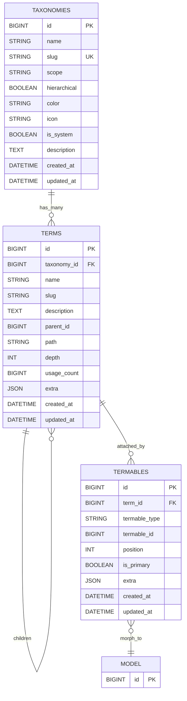

# deljdlx/taxonomy

Taxonomies génériques et typées pour Laravel (12, PHP ≥ 8.3) : termes hiérarchiques avec chemin matérialisé, slugs uniques par taxonomy, et pivot polymorphe pour attacher des termes à n’importe quel modèle Eloquent.

- PSR-12, PHP typé, API REST, commandes artisan, presets de provisioning

## Sommaire

- [Présentation et fonctionnalités](#features)
- [Prérequis et installation](#install)
- [Configuration](#config)
- [Modèle de données (schéma)](#schema)
- [Eloquent (modèles & trait)](#eloquent)
- [API REST (taxonomies, terms, termables)](#api)
- [Commandes Artisan (seed, reset)](#commands)
- [Scopes & conventions](#scopes)
- [Exemple prêt-à-l’emploi (criticality@global)](#example-criticality)
- [Tests](#tests)
- [Roadmap](#roadmap)
- [Licence](#license)

## Présentation et fonctionnalités
<a id="features"></a>

- Taxonomies et termes, hiérarchiques ou plats
- Contrainte d’unicité de slug par taxonomy, calcul de `path` et `depth`
- Attachement de termes à n’importe quel modèle via pivot polymorphe
- API REST complète (CRUD + move + attach/detach/sync)
- Provisioning idempotent via presets, et reset sûr avec prune

## Prérequis et installation
<a id="install"></a>

Ce package est inclus en path-repository dans ce monorepo.

- `composer.json` (racine) référence `packages/deljdlx/taxonomy`
- Require: `"deljdlx/taxonomy": "*@dev"`
- L’auto-discovery enregistre `Deljdlx\Taxonomy\TaxonomyServiceProvider`

Exécuter les migrations:

```bash
php artisan migrate
```

## Configuration
<a id="config"></a>

Fichier `config/taxonomy.php` (publishable avec le tag `taxonomy-config`):

- `route_prefix` (par défaut `app/api`) : base des routes API
- `cache` : placeholder pour un futur cache d’arbres

Publier la config si nécessaire:

```bash
php artisan vendor:publish --tag=taxonomy-config
```

## Modèle de données (schéma)
<a id="schema"></a>

- `taxonomies`: name, slug (unique), scope, hierarchical, color, icon, description
- `terms`: taxonomy_id, name, slug (unique par taxonomy), parent_id, `path`, `depth`, `usage_count`, `extra`
- `termables`: pivot polymorphe, avec `position`, `is_primary`, `extra`

### Schéma (Mermaid)



## Eloquent (modèles & trait)
<a id="eloquent"></a>

- `Deljdlx\Taxonomy\Models\Taxonomy`
- `Deljdlx\Taxonomy\Models\Term`
- `Deljdlx\Taxonomy\Concerns\HasTerms` — à ajouter sur tout modèle devant être “taggable”.

Exemple:

```php
use Deljdlx\Taxonomy\Concerns\HasTerms;

class Post extends Model
{
    use HasTerms;
}
```

Accès:

```php
$post = Post::find(1);
$labels = $post->terms; // Collection<Term>
```

Concepts clés:

- Slugs: générés si absents (basés sur `name`), uniques par taxonomy
- Hiérarchie: `path` matérialise l’arborescence (`/parent/child`), `depth` est recalculé
- Compteurs: `usage_count` maintenu lors d’attach/detach/sync

## API REST (base: `/app/api`, configurable)
<a id="api"></a>

### Taxonomies

- GET `/app/api/taxonomies` — list (filters: `id`, `name`, `slug`, `scope`; sorts: `id`, `name`, `slug`, `scope`)
- POST `/app/api/taxonomies` — `{ name, slug?, scope?, hierarchical?, color?, icon?, description? }`
- GET `/app/api/taxonomies/{taxonomy}` — show
- PATCH `/app/api/taxonomies/{taxonomy}` — update (mêmes champs)
- DELETE `/app/api/taxonomies/{taxonomy}` — delete (bloqué si elle a des termes)

### Terms

- GET `/app/api/taxonomies/{taxonomy}/terms` — list (filters: `id`, `parent_id`, `name`, `slug`; sorts: `id`, `name`, `slug`, `depth`, `usage_count`)
- POST `/app/api/taxonomies/{taxonomy}/terms` — `{ name, slug?, description?, parent_id? }`
- GET `/app/api/terms/{term}` — show
- PATCH `/app/api/terms/{term}` — `{ name?, slug?, description?, parent_id? }` (recalcule `path/depth` si parent/slug changent)
- DELETE `/app/api/terms/{term}` — delete (bloqué si le terme a des enfants)
- POST `/app/api/terms/{term}/move` — `{ parent_id: int|null }` (anti-cycle, anti cross-taxonomy)

### Termables (attacher des termes à un modèle)

- POST `/app/api/termables/attach` — `{ model_type, model_id, term_ids[] }` ou `{ model_type, model_id, taxonomy_slug, slugs[] }`
- POST `/app/api/termables/detach` — idem
- POST `/app/api/termables/sync` — `{ model_type, model_id, taxonomy_slug, slugs[] }` (ou `term_ids[]`)

## Commandes Artisan
<a id="commands"></a>

### Provisioning — `taxonomy:seed`

Provisionnement idempotent de taxonomies/termes illustratifs.

```bash
php artisan taxonomy:seed --preset=global --scope=global
```

Options:


Exemples:

```bash
# Voir ce qui serait créé sans écrire
php artisan taxonomy:seed --preset=global --scope=global --dry-run

# Appliquer le preset kanban sous le scope kanban
php artisan taxonomy:seed --preset=kanban --scope=kanban

# Provisionner tous les presets
php artisan taxonomy:seed --preset=all --scope=global
```

### Demo: taxonomy_demo_contents seeding

To quickly see taxonomies in action, a demo command creates a simple table `taxonomy_demo_contents`, inserts sample rows, and attaches random existing terms via the `termables` pivot.

- Create and seed demo contents (25 rows, 1–5 random tags each):

```
php artisan taxonomy:demo:contents --count=25 --min-tags=1 --max-tags=5 --scope=global --force
```

Options:
- --count: number of demo rows to create (default 25)
- --min-tags/--max-tags: per-row tag count range (default 1..5)
- --scope: filter terms to a scope
- --taxonomy: filter terms to a specific taxonomy slug
- --truncate: clears `taxonomy_demo_contents` and related `termables` before seeding
- --recreate: drops then recreates the demo table
- --seed-taxonomies: auto-seed base taxonomies if no terms found
- --force: required in production environments

Notes:
- The demo entity model is `Deljdlx\\Taxonomy\\Models\\TaxonomyDemoContent` using the `HasTerms` trait.
- Pivot records are ordered by `position` and mark the first tag as `is_primary`.

### InteractsWithTerms trait (high-level API)

Add `Deljdlx\\Taxonomy\\Concerns\\InteractsWithTerms` to any model that already uses `HasTerms` to get a convenient API for tagging.

Example model:

```php
use Deljdlx\\Taxonomy\\Concerns\\HasTerms;
use Deljdlx\\Taxonomy\\Concerns\\InteractsWithTerms;

class Post extends Model
{
  use HasTerms, InteractsWithTerms;
}
```

Attach tags by slugs or IDs, within a taxonomy and scope:

```php
$post->tag(['urgent', 'backend'], taxonomy: 'labels', scope: 'kanban', options: [
  'createMissing' => true,
  'primary' => true,
]);
```

Sync tags (attach the given set and remove the rest):

```php
$post->syncTags([12, 27, 'ui'], 'labels', 'kanban', [
  'reindexPositions' => true,
]);
```

Set primary tag within a taxonomy:

```php
$post->setPrimaryTag('urgent', 'labels', 'kanban');
```

Query helpers (scopes):

```php
// Posts having any of these terms
Post::withAnyTerms(['urgent','backend'], 'labels', 'kanban')->get();

// Posts having all of these terms
Post::withAllTerms(['urgent','backend'], 'labels', 'kanban')->get();

// Posts with no term in taxonomy
Post::withNoTerms('labels', 'kanban')->get();
```

Notes:
- When passing a taxonomy by slug and it exists across multiple scopes, you must provide the scope to disambiguate.
- With `createMissing=true`, unknown slugs are created as new terms in the given taxonomy (flat, no parent).

### HasTaxonomies trait (derived helpers)

Add `Deljdlx\\Taxonomy\\Concerns\\HasTaxonomies` to a model (in addition to `HasTerms`) to fetch the set of taxonomies it currently uses and to filter by taxonomy.

Example model:

```php
use Deljdlx\\Taxonomy\\Concerns\\HasTerms;
use Deljdlx\\Taxonomy\\Concerns\\HasTaxonomies;

class Post extends Model
{
  use HasTerms, HasTaxonomies;
}
```

Read helpers:

```php
$post->taxonomies();          // Collection<Taxonomy>
$post->taxonomiesByScope();   // [ 'global' => collect([...]), 'kanban' => collect([...]) ]
```

Query scope:

```php
// Models that have at least one term from a given taxonomy
Post::withTaxonomy('labels', 'kanban')->get(); // by slug + scope
Post::withTaxonomy(3)->get();                  // by taxonomy id
```
Presets inclus:

- global: `criticality`, `priority`, `risk`, `effort`
- kanban: `status`, `labels`, `components` (arbre app/infra)
- blog: `category` (tech/php/js, life, news), `tags`
- ecommerce: `category` (electronics/*, fashion/*), `tags`

### Reset sûr — `taxonomy:reset`

Réinitialise un preset de manière sûre: upsert + prune optionnel, avec export possible.

```bash
php artisan taxonomy:reset --preset=global --scope=global
```

Options:

- `--preset=kanban|blog|ecommerce|global|all`
- `--scope=...` (défaut: même valeur que `--preset`)
- `--dry-run` (n’affiche que ce qui serait fait)
- `--export=path.json` (export JSON avant modifs; chemin relatif → `storage/app/...`)
- `--prune` (supprime les termes non présents dans le preset)
- `--allow-detach` (autorise le détachement des relations avant suppression — dangereux)

Sécurité par défaut:

- Sans `--prune`, aucun terme n’est supprimé
- Avec `--prune`, les termes utilisés sont conservés par défaut (références dans `termables`)
- Un parent n’est pas supprimé s’il reste des enfants

Exemples:

```bash
# Dry-run: voir les suppressions potentielles
php artisan taxonomy:reset --preset=global --scope=global --prune --dry-run

# Appliquer réellement la prune
php artisan taxonomy:reset --preset=global --scope=global --prune

# Exporter l’état avant de modifier
php artisan taxonomy:reset --preset=kanban --scope=kanban --export=backups/kanban.json --prune
```

## Scopes (génériques) & conventions
<a id="scopes"></a>

Utiliser un `scope` en dot-notation (façon namespaces) pour contextualiser une taxonomy.

- Forme: `domaine[.sousDomaine][.contexte][.variant]`
- Exemples: `global`, `kanban`, `kanban.board`, `incident.management`, `ecommerce.catalog`, `quality.assessment`
- Règles: segments sans espaces, `global` pour les ontologies transverses; multi-tenant futur: `tenant:acme.kanban`

Une même taxonomy (ex: `criticality`) peut exister sous plusieurs scopes (`global`, `incident.management`) sans collision.

## Exemple prêt-à-l’emploi: criticality@global
<a id="example-criticality"></a>

- Taxonomy: `slug=criticality`, `name=Criticité`, `scope=global`, `hierarchical=false`
- Terms (fort → faible), tri par `extra.rank` et i18n via `extra.translations`:
  - blocker (rank 100, color red, icon ti-alert-triangle)
  - critical (80), major (60), minor (40), trivial (20)

Exemples API:

```bash
# créer la taxonomy
curl -X POST /app/api/taxonomies \
  -H 'Content-Type: application/json' \
  -d '{
    "name": "Criticité",
    "slug": "criticality",
    "scope": "global",
    "hierarchical": false
  }'

# créer un term (ID taxonomy supposé = 1)
curl -X POST /app/api/taxonomies/1/terms \
  -H 'Content-Type: application/json' \
  -d '{
    "name": "Blocker",
    "slug": "blocker",
    "extra": {"rank": 100, "color": "red", "icon": "ti-alert-triangle"}
  }'
```

## Tests
<a id="tests"></a>

Exécuter les tests unitaires et d’intégration:

```bash
php artisan test --testsuite=Unit,Feature
```

Dans ce repo, les tests couvrent notamment:

- CRUD taxonomies/terms et move
- Attach/detach/sync de terms
- Commandes `taxonomy:seed` et `taxonomy:reset`
- CRUD de `Post` (exemple d’API)

## Roadmap
<a id="roadmap"></a>

- Observers/Service pour `path/depth` + cache d’arbres
- Cache par taxonomy + invalidation
- Policies/permissions
- OpenAPI/Swagger et publication UI
- Commandes artisan: rebuild path/usage_count

## Licence
<a id="license"></a>

MIT